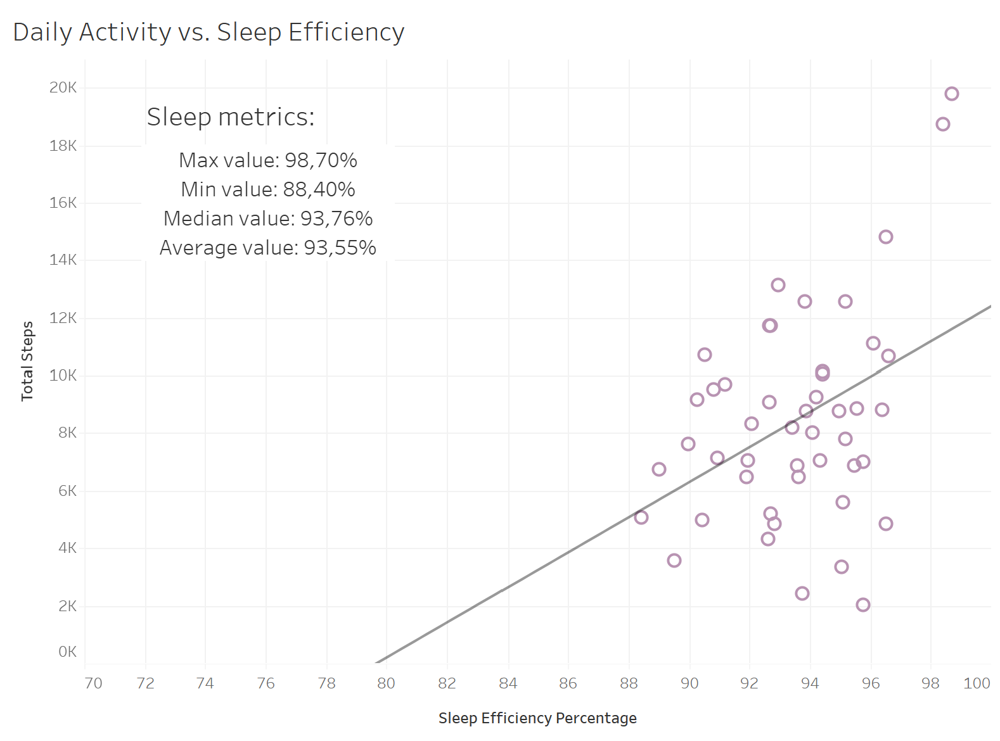
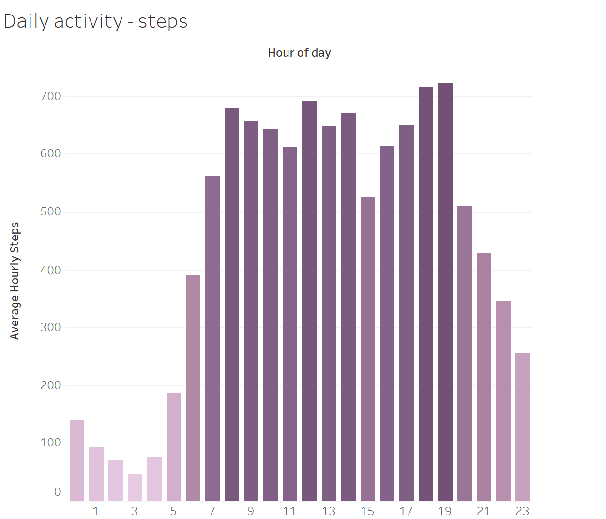
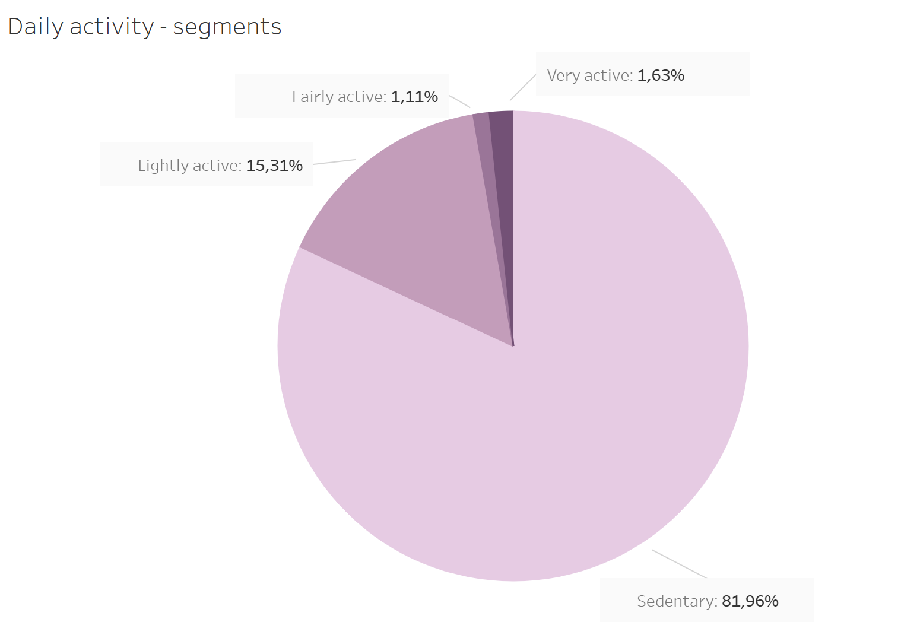

# 📑 Bellabeat Case Study: Google Data Analytics Capstone

## 📖 Scenario
Bellabeat is a successful, high-tech manufacturer of health-focused products for women. The executive team wants to unlock new global growth opportunities. As a junior data analyst on Bellabeat's marketing analytics team, I have been tasked with analyzing smart device fitness data from consumers. 
The objective of this case study is to analyze consumer usage habits, identify key behavioral trends, and provide high-level strategic recommendations to guide Bellabeat’s future marketing and drive product adoption.

---

## 1. 💡 Ask

### **Business Task**
To analyze public FitBit smart device data in order to identify customer behavior patterns and generate actionable, data-driven recommendations for Bellabeat's marketing efforts as the brand expands globally. 

### **Stakeholders**
*   **Primary Stakeholders:** 
    *   **Urška Sršen** (Co-founder and Chief Creative Officer)
    *   **Sando Mur** (Co-founder and Executive Team Member)
*   **Secondary Stakeholders:** 
    *   **Bellabeat Marketing Analytics Team** (Responsible for executing marketing strategies based on data insights)

---
## 2. 📋 Prepare

### **Data Source**
The primary dataset used for this analysis is the **FitBit Fitness Tracker Data** (Public Domain, made available by Mobius via Kaggle). It contains personal fitness tracker data from thirty-three Fitbit users.

### **ROCCC Framework Evaluation**
To ensure data integrity, the dataset was evaluated against the **ROCCC** standards:

*   **R**eliability (**Medium/Low**): Generated by respondents from a distributed survey via Amazon Mechanical Turk.
*   **O**riginality (**Low**): Third-party data compiled from an anonymous survey.
*   **C**omprehensiveness (**Medium**): Tracks daily/hourly physical activity, steps, and sleep, but lacks critical user demographic profiles (e.g., age, location).
*   **C**urrent (**Low**): Data was collected between March 2016 and May 2016. Consumer habits regarding smart devices have evolved since then.
*   **C**ited (**Unknown**): Third-party open-source dataset.

### ⛔ **Dataset Limitations & Mitigation Strategies**

> ⚠️ **Methodological Note:** To present a reliable analysis the key limitations and mitigation approaches are summarized below:

* **Small Sample Size (Physical Activity):**  The physical activity dataset contains data from only **35 users** (`DISTINCT Id`). While sufficient for basic statistical analysis, a larger sample would improve the generalizability of findings.

* **User Engagement Drop-off (Sleep Tracking):**  The sleep dataset includes only **24 users**, limiting the strength of sleep-related conclusions. However, this also highlights an important business insight: sleep tracking shows significantly lower user engagement than daytime activity tracking.

* **Unrecorded Time (Missing Minutes):**  Daily activity records cover approximately **20–22 hours** instead of a full 24-hour period, likely due to users removing their devices. However, a mitigation strategy has been applied. Activity levels were analyzed as a **percentage of recorded time** rather than absolute daily minutes to avoid biased results.
---
## 3. 🛠️ Process

For the Data Processing phase, **Google BigQuery (SQL)** was chosen over spreadsheet software to securely and efficiently manipulate thousands of rows of time-series and granular hourly data.

### 🧱 Data Integrity & Formatting

*   **ID & Date Standardization:** Standardized all user `Id` columns from text strings into integer formats (`INT64`) across all tables to ensure indexed keys. Applied `PARSE_DATE` and `CAST` functions to convert inconsistent, mixed-text timestamps into proper SQL `DATE` or `DATETIME` formats.
*   **Table Consolidation:** Executed `INNER JOIN` operations to unify daily activity and sleep metrics into a consolidated analytical view, matching distinct users by both `Id` and `Date`.
*   **Quality Assurance Checks:** Evaluated metrics against physical logical boundaries (e.g., verifying that sleep efficiency remained strictly between 0–100% and total logged minutes did not exceed logical limits). Executed `GROUP BY ... HAVING COUNT(*) > 1` scans to guarantee no duplicate rows or overlapping data records remained.

### 🗂️ Data Manipulation Log

> 💡 *Click on the table section below to expand and view the SQL cleaning script.*

<details>
<summary><b>🔹 Table: total_sleep_day</b></summary>
<br>

* **Actions:** Converted `Id` from `STRING` to `INT64`, transformed `SleepDay` into a proper `DATE` format, and removed 3 identical duplicate rows using `DISTINCT`.
* **SQL Script executed:**

```sql
CREATE OR REPLACE TABLE `bellabeat-case-study-498811.fitbit_data.total_sleep_day` AS (
  -- Step 2: Summing the time of sleep on clean data
  SELECT
    Id,
    SleepDay,
    SUM(TotalSleepRecords) AS TotalSleepRecords,
    SUM(TotalMinutesAsleep) AS TotalMinutesAsleep,
    SUM(TotalTimeInBed) AS TotalTimeInBed
  FROM (
    -- Step 1: Removing duplicates
    SELECT DISTINCT * FROM `bellabeat-case-study-498811.fitbit_data.total_sleep_day`
  )
  GROUP BY
    Id,
    SleepDay
);
```

</details>

<details>
<summary><b>🔹 Table: total_daily_activity</b></summary>
<br>

* **Actions:** Standardized `Id` into `INT64`, converted `ActivityDate` into a proper `DATE` format, and detected/eliminated cloned entries dated April 12, 2016.
* **SQL Script executed:**

```sql
CREATE OR REPLACE TABLE `bellabeat-case-study-498811.fitbit_data.total_daily_activity` AS (
  SELECT
    CAST(Id AS INT64) AS Id, -- Displaying Id is an integer
    CAST(ActivityDate AS DATE) AS ActivityDate, -- Displaying ActivityDate as a date
    TotalSteps,
    TotalDistance,
    TrackerDistance,
    LoggedActivitiesDistance,
    VeryActiveDistance,
    ModeratelyActiveDistance,
    LightActiveDistance,
    SedentaryActiveDistance,
    VeryActiveMinutes,
    FairlyActiveMinutes,
    LightlyActiveMinutes,
    SedentaryMinutes,
    Calories
  FROM (
    -- Removing duplicates
    SELECT DISTINCT * FROM `bellabeat-case-study-498811.fitbit_data.total_daily_activity`
  )
);
```

</details>
<details>
<summary><b>🔹 Table: total_hourly_steps</b></summary>
<br>

* **Actions:** Converted `StepTotal` into `INT64`, standardized `ActivityHour` into a proper `TIMESTAMP` format, and combined both monthly datasets using `UNION ALL` to create a unified hourly activity table for time-series analysis.
* **SQL Script executed:**

```sql
CREATE OR REPLACE TABLE `bellabeat-case-study-498811.fitbit_data.total_hourly_steps` AS (

  -- 1. First month - fixing date and time format, converting steps into integers
  SELECT
    Id,
    PARSE_TIMESTAMP('%m/%d/%Y %I:%M:%S %p', ActivityHour) AS ActivityHour,
    CAST(StepTotal AS INT64) AS StepTotal
  FROM `bellabeat-case-study-498811.fitbit_data.hourly_steps_v1`

  UNION ALL

  -- 2. Second month - fixing date and time format, converting steps into integers
  SELECT
    Id,
    PARSE_TIMESTAMP('%m/%d/%Y %I:%M:%S %p', ActivityHour) AS ActivityHour,
    CAST(StepTotal AS INT64) AS StepTotal
  FROM `bellabeat-case-study-498811.fitbit_data.hourly_steps_v2`

);
```

</details>

<details>
<summary><b>🔹 Table: activity_and_sleep_correlation</b></summary>
<br>

* **Actions:** Joined daily activity and sleep datasets using an `INNER JOIN` on `Id` and `Date`. Engineered two new analytical features: `MinutesWastedInBed` (time spent in bed but not asleep) and `SleepEfficiencyPercentage` (percentage of time in bed spent sleeping). Applied a quality filter to exclude zero-step days and reduce non-wear bias.
* **SQL Script executed:**

```sql
SELECT
    -- 1. Standardizing keys (dates are already in DATE format)
    CAST(a.Id AS INT64) AS Id,
    a.ActivityDate,

    -- 2. Daily activity metrics from total_daily_activity
    a.TotalSteps,
    a.TotalDistance,
    a.VeryActiveMinutes,
    a.FairlyActiveMinutes,
    a.LightlyActiveMinutes,
    a.SedentaryMinutes,
    a.Calories,

    -- 3. Sleep metrics from total_sleep_day
    s.TotalSleepRecords,
    s.TotalMinutesAsleep,
    s.TotalTimeInBed,

    -- 4. New calculated columns (Feature Engineering)
    (s.TotalTimeInBed - s.TotalMinutesAsleep) AS MinutesWastedInBed,
    (s.TotalMinutesAsleep / s.TotalTimeInBed) AS SleepEfficiencyPercentage

FROM `bellabeat-case-study-498811.fitbit_data.total_daily_activity` AS a
INNER JOIN `bellabeat-case-study-498811.fitbit_data.total_sleep_day` AS s
    -- Consolidation via unique user Id and matching Date columns directly
    ON CAST(a.Id AS INT64) = CAST(s.Id AS INT64)
    AND a.ActivityDate = s.SleepDay

-- Data quality filter to mitigate non-wear days ("Zero-Step Skew")
WHERE a.TotalSteps > 0;
```

</details>
<details>
<summary><b>🔹 Table: cleaned_activity_with_segments (User segmentation)</b></summary>
<br>

* **Actions:** Built a user segmentation table using Common Table Expressions (`WITH`). Calculated each user's true average daily step count while excluding non-wear days (`TotalSteps > 0`) to prevent downward bias. Classified users into four standardized activity segments using a `CASE WHEN` statement (`Sedentary`, `Lightly active`, `Fairly active`, `Very active`) and joined the resulting segments back to the original daily activity table, creating a reusable categorical dimension for Tableau visualizations.

* **SQL Script executed:**

```sql
CREATE OR REPLACE TABLE `bellabeat-case-study-498811.fitbit_data.cleaned_activity_with_segments` AS (

  -- Step 1: Calculate the average daily steps for EACH unique user (excluding days when the watch wasn't worn)
  WITH user_averages AS (
    SELECT
      Id,
      AVG(TotalSteps) AS avg_daily_steps
    FROM
      `bellabeat-case-study-498811.fitbit_data.total_daily_activity`
    WHERE
      TotalSteps > 0 -- Filter out days with 0 steps to avoid skewing the average
    GROUP BY
      Id
  ),

  -- Step 2: Categorize each user into a permanent segment based on their TRUE average steps
  user_segments AS (
    SELECT
      Id,
      avg_daily_steps,
      CASE
        WHEN avg_daily_steps < 5000 THEN 'Sedentary'
        WHEN avg_daily_steps >= 5000 AND avg_daily_steps < 7500 THEN 'Lightly active'
        WHEN avg_daily_steps >= 7500 AND avg_daily_steps < 10000 THEN 'Fairly active'
        WHEN avg_daily_steps >= 10000 THEN 'Very active'
        ELSE 'No data'
      END AS ActivitySegment
    FROM
      user_averages
  )

  -- Step 3: Combine the calculated segments with the original daily activity records
  SELECT
    act.*,
    ROUND(seg.avg_daily_steps, 0) AS UserAvgDailySteps,
    seg.ActivitySegment
  FROM
    `bellabeat-case-study-498811.fitbit_data.total_daily_activity` AS act
  JOIN
    user_segments AS seg
    ON act.Id = seg.Id
);
```

</details>
<details>
<summary><b>🔹 Table: hourly_steps_trends (Time-Series Aggregation)</b></summary>
<br>

* **Actions:** Extracted the hour component (`0–23`) from timestamp values using `EXTRACT(HOUR FROM ...)`. Filtered out non-wear periods (`StepTotal > 0`) and aggregated all user records into 24 hourly benchmarks, revealing overall daily activity patterns suitable for time-series visualization in Tableau.

* **SQL Script executed:**

```sql
CREATE OR REPLACE TABLE `bellabeat-case-study-498811.fitbit_data.hourly_steps_trends` AS (

  -- Step 1: Extract the hour from the timestamp and clean the data
  WITH formatted_hourly_data AS (
    SELECT
      Id,
      -- Extracting only the hour integer (0 to 23) from the ActivityHour column
      EXTRACT(HOUR FROM ActivityHour) AS HourOfDay,
      StepTotal
    FROM
      `bellabeat-case-study-498811.fitbit_data.total_hourly_steps`
    WHERE
      StepTotal > 0 -- Filtering out hours when the device wasn't worn to ensure accurate averages
  )

  -- Step 2: Calculate the overall average steps for each hour of the day
  SELECT
    HourOfDay,
    ROUND(AVG(StepTotal), 0) AS AvgStepsPerHour
  FROM
    formatted_hourly_data
  GROUP BY
    HourOfDay
  ORDER BY
    HourOfDay ASC
);
```

</details>

 ### 🧹 Advanced Data Cleaning & Methodology

> 💡 *Click on the section below to expand and review the advanced data cleaning decisions, anomaly handling, and analytical methodology.*

<details>
<summary><b>🔹 Key Data Quality Decisions</b></summary>
<br>

...

* **Hardware-generated data:** Since the dataset originated from Fitbit devices rather than manual user input, no typo correction or text cleaning was required.

* **Non-wear day filtering:** Records with `TotalSteps = 0` or `StepTotal = 0` were treated as device non-wear periods rather than true inactivity. These observations were excluded from baseline calculations (`WHERE TotalSteps > 0`) to avoid underestimating average user activity.

* **Sleep telemetry anomaly:** Extremely long sleep sessions (>720 minutes in bed) were identified as sensor errors caused by off-wrist tracking. These records were removed using `TotalTimeInBed <= 720` while preserving realistic long sleep durations.

* **Metric normalization:** Sleep quality was measured using a calculated field (`SleepEfficiencyPercentage = TotalMinutesAsleep / TotalTimeInBed`) instead of raw minutes, allowing meaningful comparisons across users with different sleep durations.

* **Statistical outlier handling:** One user with exceptionally low sleep efficiency (~60%) disproportionately influenced the regression model. The outlier was excluded from the Tableau trend line to better represent the overall population while remaining documented as a potentially valuable user persona.

* **Visualization optimization:** The sleep efficiency axis was limited to **70–100%**, improving chart readability without altering the underlying data.

</details>

---

## 4. 🛠️ Analyze

To identify actionable consumer behavior patterns, the cleaned dataset was analyzed from three perspectives: **sleep quality**, **daily activity patterns**, and **hourly activity trends**. The findings below summarize the most relevant insights derived from the SQL analysis and Tableau visualizations.

### 📈 Insight 1: Daily Activity vs. Sleep Efficiency



#### Key Findings

* **The Bedtime Gap:** Since some users present rather low sleep efficiency percentage it means they spend a noticeable amount of time awake in bed, creating a gap between total time in bed and actual sleep.
* **Movement–Sleep Synergy:** Higher daily step counts are associated with more consistent and higher sleep efficiency.
* **Healthy Sleep Baseline:** The average sleep efficiency reached **93.55%**, indicating that most users sleep well once they fall asleep.

#### Business Insight

Higher daily activity is associated with better sleep quality, while the gap between time in bed and time asleep highlights an opportunity for Bellabeat to promote physical activity alongside bedtime routines and sleep optimization features.

### 🚶 Insight 2: Daily Activity Patterns



#### Key Findings

* **Morning Surge:** Activity rises rapidly between **05:00–08:00**, reaching an early peak of **680 steps/hour**, reflecting morning routines and commutes.
* **Workday Plateau:** From **08:00–15:00**, step counts remain relatively stable before dropping to a daytime low at **15:00** (526 steps/hour), suggesting a typical afternoon slowdown.
* **Evening Peak:** Activity increases again after work, reaching the highest daily average at **19:00** with **724 steps/hour**, before declining into the evening.

#### Business Insight

User activity follows clear daily routines, with movement concentrated before and after standard working hours. These predictable patterns create opportunities for Bellabeat to deliver timely reminders, activity challenges, and personalized wellness prompts during periods of lower activity—particularly in the afternoon—to encourage more consistent movement throughout the day.


### 🏃 Insight 3: Daily Activity Segmentation



#### Key Findings

* **Sedentary Users:** The majority of users (**81.96%**) fall into the sedentary category, representing the dominant lifestyle pattern in the dataset.
* **Lightly Active Users:** **15.31%** of users show light activity levels, while only a small fraction reach higher activity categories:
  * Fairly Active: **1.11%**
  * Very Active: **1.63%**

#### Business Insight

The analysis shows that Bellabeat users are not primarily fitness-focused consumers. Instead, most users have low daily activity levels, highlighting an opportunity for Bellabeat to focus on habit-building, movement encouragement, and sedentary behavior prevention rather than advanced athletic tracking.

---

## 5. 📊 Share

The final insights were transformed into interactive visualizations and a concise executive presentation designed to communicate key findings and product opportunities to Bellabeat stakeholders.

### 🎨 Interactive Tableau Dashboard

Explore the complete analysis through interactive dashboards featuring user segmentation, activity patterns, and sleep-related insights.

[Bellabeat Case Study | Tableau Public](https://public.tableau.com/authoring/BellabeatCaseStudy_17815253373240/Dashboard2#2)

### 📑 Executive Presentation

A business-focused slide deck summarizing the methodology, key insights, and strategic recommendations based on the analysis.

[View Presentation Slides](https://canva.link/b32zj2w3henq36n)

---

## 6. 🚀 Act

Based on the data-driven insights uncovered during the analysis phase, the following strategic recommendations focus on product development, feature optimization, and targeted marketing alignment.

### 1. Combating the "Sedentary Trap" via Micro-Habits

**Data Insight:** Our user segmentation analysis revealed that an overwhelming **81.96%** of users fall into the Sedentary category, proving that the primary audience consists of everyday corporate workers or low-activity individuals, rather than fitness enthusiasts.

**Business Recommendation:** Shift the application’s core positioning from advanced fitness tracking to an **"Everyday Wellness Companion."**

**Actionable Feature:** Introduce a **"Smart Desk Break"** feature within the Bellabeat app. Instead of generic hourly alerts, implement stylish micro-interventions in a witty way, e.g. *"Productivity increases after movement. Science says so.", "Your water bottle misses you.", "Caring for yourself takes less than two minutes."*, especifically active during standard office hours (**09:00–17:00**).


### 2. Capturing the Post-Work Momentum (The 19:00 Peak)

**Data Insight:** The hourly time-series tracking identified that physical activity builds steadily post-work, reaching its absolute global peak at **19:00 (7:00 PM)** with **724 steps/hour**, right after a severe mid-afternoon drop at **15:00**.

**Business Recommendation:** Execute precision-timed user engagement. The dataset proves that users are most physically receptive and available for health-conscious actions in the evening.

**Actionable Feature:** Deploy dynamic, predictive push notifications around **18:15**. Rather than alerting users during their peak activity, the app should nudge them 45 minutes before (e.g., *"The weather is perfect for a 20-minute evening walk to clear your head after work"*). Additionally, introduce an afternoon energy-recharge feature at **15:00** (such as a 3-minute guided breathing exercise) to combat the documented mid-afternoon slump.


### 3. Helping Users Keep Their High Sleep Quality

**Data Insight:** Our analysis shows that Bellabeat users achieve strong sleep quality. However, the chart also reveals that users who are more active during the day have more stable and predictable sleep patterns, with fewer sudden drops in sleep quality.

**Business Recommendation:** Use the app to show users the direct connection between their daily movement and their night's rest.

**Actionable Feature:** Introduce a **"Sleep Protector"** feature. The app can send a positive morning notification when a user achieves both their step goal and high sleep quality (e.g., *"Your active day yesterday paid off! You achieved 94% sleep efficiency last night. Keep it up today!"*). For nights when efficiency slightly dips, offer simple, relaxing evening wind-down tools such as short meditation or breathing exercises to help users ease into rest.

## Next Steps & Future Scope

To maximize the business impact of these recommendations, the following next steps are proposed:

1. **A/B Testing Notifications:** Design an A/B test for app push notifications—testing a targeted pre-peak nudge (e.g., at 18:15) against a control group to measure its effect on evening step counts.
2. **Feature Prototyping:** Collaborate with the product team to prototype the **"Smart Desk Break"** and **"Sleep Protector"** features within the Bellabeat app.
3. **Dataset Expansion:** Collect a newer, larger, and demographically diverse dataset (including age, gender, and geographic location) to validate findings beyond the public Fitbit dataset and eliminate historical bias.
